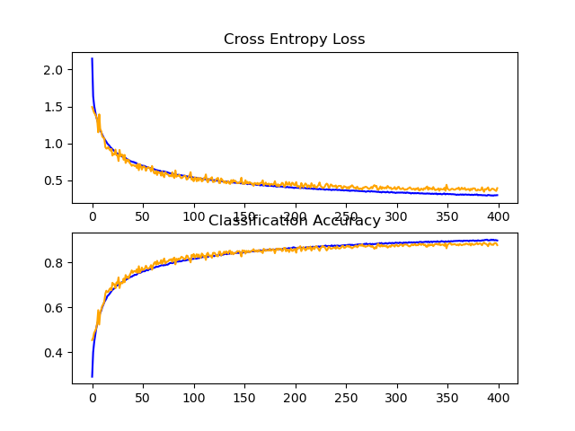

<div id="top"></div>
<!--
*** Thanks for checking out the Best-README-Template. If you have a suggestion
*** that would make this better, please fork the repo and create a pull request
*** or simply open an issue with the tag "enhancement".
*** Don't forget to give the project a star!
*** Thanks again! Now go create something AMAZING! :D
-->


<!-- PROJECT SHIELDS -->
<!--
*** I'm using markdown "reference style" links for readability.
*** Reference links are enclosed in brackets [ ] instead of parentheses ( ).
*** See the bottom of this document for the declaration of the reference variables
*** for contributors-url, forks-url, etc. This is an optional, concise syntax you may use.
*** https://www.markdownguide.org/basic-syntax/#reference-style-links
-->


<!-- PROJECT LOGO -->
<br />
<div align="center">
  <h3 align="center">CIFAR10</h3>
  <p align="center">
    CIFAR10 implementation using keras in python
  </p>
</div>

<!-- ABOUT THE PROJECT -->
## About The Project

This project uses code from https://machinelearningmastery.com/how-to-develop-a-cnn-from-scratch-for-cifar-10-photo-classification/ to implement and test the time it takes to run training of CIFAR10.

The code was tested on a PC with 16GB of RAM, an i7-5820k and an Nvidia RTX 2070 using Python 3.8 and Pycharm Professional 2021.1.1 on a Windows 10 machine.

<p align="right">(<a href="#top">back to top</a>)</p>

<!-- GETTING STARTED -->
## Getting Started

### Prerequisites

* Python 3.8
  
  ```
  https://www.python.org/ftp/python/3.8.0/python-3.8.0-amd64.exe
  ```
* Pycharm Professional
    ```
    https://www.jetbrains.com/pycharm/download/#section=windows
    ```
* CUDA Toolkit 11.2
    ```
    https://developer.nvidia.com/cuda-11.2.0-download-archive
    Add installation folder to PATH environment variable windows
    ```
* cuDNN 8.1
    ```
    https://developer.nvidia.com/compute/machine-learning/cudnn/secure/8.1.0.77/11.2_20210127/cudnn-11.2-windows-x64-v8.1.0.77.zip
    Add installation folder to PATH environment variable windows
    ```
### Installation

1. Install all prerequisites from above.
2. Clone the repo
   ```sh
   git clone https://github.com/exothermix/CIFAR10.git
   ```
3. Open cloned project in PyCharm
4. Create Python 3.8 virtual environment in PyCharm
5. Use terminal in PyCharm to install pip packages
   ```sh
   pip install -r requirements.txt
   ```
6. Run the CIFAR10 file in PyCharm IDE.

<p align="right">(<a href="#top">back to top</a>)</p>


## Program Output
The training took 2 hours and 52 minutes on Nvidia RTX 2070 with each epoch taking 26 seconds to finish.
One epoch was tested on CPU and it took 125 seconds to finish which means that training 400 epochs would take 13 hours and 52 minutes. 
<details>
    <summary>Click to Expand</summary>

    C:\Users\alifh\anaconda3\envs\CIFAR10\python.exe C:/Users/alifh/PycharmProjects/CIFAR10/CIFAR10.py
    2022-04-20 20:44:07.440626: I tensorflow/core/common_runtime/gpu/gpu_device.cc:1549] Created device /job:localhost/replica:0/task:0/device:GPU:0 with 6007 MB memory:  -> device: 0, name: NVIDIA GeForce RTX 2070, pci bus id: 0000:03:00.0, compute capability: 7.5
    2022-04-20 20:44:11.586611: I tensorflow/stream_executor/cuda/cuda_dnn.cc:384] Loaded cuDNN version 8100
    Epoch 1/400 
    781/781 [==============================] - 31s 34ms/step - loss: 2.1487 - accuracy: 0.2919 - val_loss: 1.4924 - val_accuracy: 0.4545
    Epoch 2/400
    781/781 [==============================] - 26s 34ms/step - loss: 1.6396 - accuracy: 0.4005 - val_loss: 1.4553 - val_accuracy: 0.4650
    Epoch 3/400
    781/781 [==============================] - 26s 33ms/step - loss: 1.5117 - accuracy: 0.4447 - val_loss: 1.4153 - val_accuracy: 0.4868
    Epoch 4/400
    781/781 [==============================] - 26s 33ms/step - loss: 1.4335 - accuracy: 0.4743 - val_loss: 1.3924 - val_accuracy: 0.4953
    Epoch 5/400
    781/781 [==============================] - 27s 34ms/step - loss: 1.3632 - accuracy: 0.5046 - val_loss: 1.3636 - val_accuracy: 0.5065
    Epoch 6/400
    781/781 [==============================] - 28s 36ms/step - loss: 1.3137 - accuracy: 0.5258 - val_loss: 1.3101 - val_accuracy: 0.5308
    Epoch 7/400
    781/781 [==============================] - 26s 33ms/step - loss: 1.2649 - accuracy: 0.5429 - val_loss: 1.1501 - val_accuracy: 0.5875
    Epoch 8/400
    781/781 [==============================] - 26s 33ms/step - loss: 1.2179 - accuracy: 0.5613 - val_loss: 1.3930 - val_accuracy: 0.5235
    Epoch 9/400
    781/781 [==============================] - 27s 34ms/step - loss: 1.1787 - accuracy: 0.5761 - val_loss: 1.1896 - val_accuracy: 0.5780
    Epoch 10/400
    781/781 [==============================] - 26s 34ms/step - loss: 1.1484 - accuracy: 0.5849 - val_loss: 1.1646 - val_accuracy: 0.5902
    Epoch 11/400
    781/781 [==============================] - 26s 34ms/step - loss: 1.1185 - accuracy: 0.6012 - val_loss: 1.0921 - val_accuracy: 0.6066
    Epoch 12/400
    781/781 [==============================] - 26s 33ms/step - loss: 1.0873 - accuracy: 0.6108 - val_loss: 1.0782 - val_accuracy: 0.6132
    Epoch 13/400
    781/781 [==============================] - 28s 36ms/step - loss: 1.0643 - accuracy: 0.6228 - val_loss: 1.0676 - val_accuracy: 0.6261
    Epoch 14/400
    781/781 [==============================] - 26s 33ms/step - loss: 1.0418 - accuracy: 0.6302 - val_loss: 0.9489 - val_accuracy: 0.6602
    Epoch 15/400
    781/781 [==============================] - 26s 33ms/step - loss: 1.0213 - accuracy: 0.6382 - val_loss: 0.9289 - val_accuracy: 0.6736
    Epoch 16/400
    781/781 [==============================] - 26s 33ms/step - loss: 0.9973 - accuracy: 0.6498 - val_loss: 0.9330 - val_accuracy: 0.6672
    Epoch 17/400
    781/781 [==============================] - 26s 33ms/step - loss: 0.9838 - accuracy: 0.6535 - val_loss: 0.9526 - val_accuracy: 0.6692
    Epoch 18/400
    781/781 [==============================] - 26s 33ms/step - loss: 0.9686 - accuracy: 0.6587 - val_loss: 0.9178 - val_accuracy: 0.6797
    Epoch 19/400
    781/781 [==============================] - 27s 34ms/step - loss: 0.9465 - accuracy: 0.6647 - val_loss: 0.9028 - val_accuracy: 0.6850
    Epoch 20/400
    781/781 [==============================] - 26s 33ms/step - loss: 0.9370 - accuracy: 0.6714 - val_loss: 0.9236 - val_accuracy: 0.6754
    Epoch 21/400
    781/781 [==============================] - 26s 33ms/step - loss: 0.9201 - accuracy: 0.6774 - val_loss: 0.8342 - val_accuracy: 0.7089
    Epoch 22/400
    781/781 [==============================] - 26s 33ms/step - loss: 0.9085 - accuracy: 0.6810 - val_loss: 0.8559 - val_accuracy: 0.7014
    Epoch 23/400
    781/781 [==============================] - 26s 33ms/step - loss: 0.8938 - accuracy: 0.6844 - val_loss: 0.8497 - val_accuracy: 0.7024
    Epoch 24/400
    781/781 [==============================] - 26s 33ms/step - loss: 0.8880 - accuracy: 0.6893 - val_loss: 0.9160 - val_accuracy: 0.6845
    Epoch 25/400
    781/781 [==============================] - 26s 33ms/step - loss: 0.8691 - accuracy: 0.6961 - val_loss: 0.8392 - val_accuracy: 0.7105
    Epoch 26/400
    781/781 [==============================] - 27s 34ms/step - loss: 0.8622 - accuracy: 0.6972 - val_loss: 0.8382 - val_accuracy: 0.7066
    Epoch 27/400
    781/781 [==============================] - 26s 33ms/step - loss: 0.8538 - accuracy: 0.7016 - val_loss: 0.7611 - val_accuracy: 0.7327
    Epoch 28/400
    781/781 [==============================] - 25s 33ms/step - loss: 0.8446 - accuracy: 0.7038 - val_loss: 0.9110 - val_accuracy: 0.6856
    Epoch 29/400
    781/781 [==============================] - 26s 33ms/step - loss: 0.8386 - accuracy: 0.7059 - val_loss: 0.8245 - val_accuracy: 0.7100
    Epoch 30/400
    781/781 [==============================] - 26s 33ms/step - loss: 0.8270 - accuracy: 0.7105 - val_loss: 0.8474 - val_accuracy: 0.7071
    Epoch 31/400
    781/781 [==============================] - 26s 33ms/step - loss: 0.8164 - accuracy: 0.7127 - val_loss: 0.8451 - val_accuracy: 0.7067
    Epoch 32/400
    781/781 [==============================] - 28s 36ms/step - loss: 0.8097 - accuracy: 0.7170 - val_loss: 0.7776 - val_accuracy: 0.7274
    Epoch 33/400
    781/781 [==============================] - 26s 33ms/step - loss: 0.8011 - accuracy: 0.7183 - val_loss: 0.8431 - val_accuracy: 0.7112
    Epoch 34/400
    781/781 [==============================] - 26s 33ms/step - loss: 0.8034 - accuracy: 0.7208 - val_loss: 0.7339 - val_accuracy: 0.7433
    Epoch 35/400
    781/781 [==============================] - 26s 33ms/step - loss: 0.7877 - accuracy: 0.7264 - val_loss: 0.7806 - val_accuracy: 0.7304
    Epoch 36/400
    781/781 [==============================] - 26s 33ms/step - loss: 0.7825 - accuracy: 0.7260 - val_loss: 0.7564 - val_accuracy: 0.7357
    Epoch 37/400
    781/781 [==============================] - 26s 33ms/step - loss: 0.7751 - accuracy: 0.7300 - val_loss: 0.7776 - val_accuracy: 0.7286
    Epoch 38/400
    781/781 [==============================] - 26s 34ms/step - loss: 0.7659 - accuracy: 0.7320 - val_loss: 0.7323 - val_accuracy: 0.7430
    Epoch 39/400
    781/781 [==============================] - 26s 33ms/step - loss: 0.7569 - accuracy: 0.7357 - val_loss: 0.7209 - val_accuracy: 0.7513
    Epoch 40/400
    781/781 [==============================] - 26s 33ms/step - loss: 0.7539 - accuracy: 0.7358 - val_loss: 0.6956 - val_accuracy: 0.7639
    Epoch 41/400
    781/781 [==============================] - 26s 33ms/step - loss: 0.7476 - accuracy: 0.7393 - val_loss: 0.7080 - val_accuracy: 0.7529
    Epoch 42/400
    781/781 [==============================] - 26s 33ms/step - loss: 0.7484 - accuracy: 0.7413 - val_loss: 0.7034 - val_accuracy: 0.7596
    Epoch 43/400
    781/781 [==============================] - 26s 33ms/step - loss: 0.7355 - accuracy: 0.7446 - val_loss: 0.6915 - val_accuracy: 0.7612
    Epoch 44/400
    781/781 [==============================] - 28s 36ms/step - loss: 0.7375 - accuracy: 0.7440 - val_loss: 0.7012 - val_accuracy: 0.7568
    Epoch 45/400
    781/781 [==============================] - 26s 33ms/step - loss: 0.7254 - accuracy: 0.7457 - val_loss: 0.6672 - val_accuracy: 0.7689
    Epoch 46/400
    781/781 [==============================] - 27s 35ms/step - loss: 0.7188 - accuracy: 0.7509 - val_loss: 0.7208 - val_accuracy: 0.7525
    Epoch 47/400
    781/781 [==============================] - 26s 33ms/step - loss: 0.7115 - accuracy: 0.7547 - val_loss: 0.6367 - val_accuracy: 0.7823
    Epoch 48/400
    781/781 [==============================] - 26s 33ms/step - loss: 0.7089 - accuracy: 0.7521 - val_loss: 0.7196 - val_accuracy: 0.7538
    Epoch 49/400
    781/781 [==============================] - 26s 33ms/step - loss: 0.7047 - accuracy: 0.7544 - val_loss: 0.6892 - val_accuracy: 0.7619
    Epoch 50/400
    781/781 [==============================] - 26s 34ms/step - loss: 0.7011 - accuracy: 0.7572 - val_loss: 0.6454 - val_accuracy: 0.7765
    Epoch 51/400
    781/781 [==============================] - 26s 33ms/step - loss: 0.6951 - accuracy: 0.7600 - val_loss: 0.6833 - val_accuracy: 0.7655
    Epoch 52/400
    781/781 [==============================] - 26s 33ms/step - loss: 0.6957 - accuracy: 0.7597 - val_loss: 0.6889 - val_accuracy: 0.7670
    Epoch 53/400
    781/781 [==============================] - 26s 33ms/step - loss: 0.6902 - accuracy: 0.7602 - val_loss: 0.6743 - val_accuracy: 0.7725
    Epoch 54/400
    781/781 [==============================] - 26s 33ms/step - loss: 0.6835 - accuracy: 0.7638 - val_loss: 0.6282 - val_accuracy: 0.7845
    Epoch 55/400
    781/781 [==============================] - 26s 33ms/step - loss: 0.6760 - accuracy: 0.7661 - val_loss: 0.6622 - val_accuracy: 0.7751
    Epoch 56/400
    781/781 [==============================] - 28s 36ms/step - loss: 0.6771 - accuracy: 0.7638 - val_loss: 0.6772 - val_accuracy: 0.7706
    Epoch 57/400
    781/781 [==============================] - 26s 33ms/step - loss: 0.6685 - accuracy: 0.7685 - val_loss: 0.6725 - val_accuracy: 0.7732
    Epoch 58/400
    781/781 [==============================] - 26s 33ms/step - loss: 0.6646 - accuracy: 0.7697 - val_loss: 0.6575 - val_accuracy: 0.7780
    Epoch 59/400
    781/781 [==============================] - 26s 33ms/step - loss: 0.6620 - accuracy: 0.7696 - val_loss: 0.6206 - val_accuracy: 0.7873
    Epoch 60/400
    781/781 [==============================] - 26s 33ms/step - loss: 0.6603 - accuracy: 0.7711 - val_loss: 0.6939 - val_accuracy: 0.7666
    Epoch 61/400
    781/781 [==============================] - 26s 33ms/step - loss: 0.6526 - accuracy: 0.7753 - val_loss: 0.6374 - val_accuracy: 0.7850
    Epoch 62/400
    781/781 [==============================] - 27s 34ms/step - loss: 0.6512 - accuracy: 0.7754 - val_loss: 0.5971 - val_accuracy: 0.7960
    Epoch 63/400
    781/781 [==============================] - 25s 33ms/step - loss: 0.6443 - accuracy: 0.7770 - val_loss: 0.5912 - val_accuracy: 0.8009
    Epoch 64/400
    781/781 [==============================] - 26s 33ms/step - loss: 0.6394 - accuracy: 0.7802 - val_loss: 0.6276 - val_accuracy: 0.7893
    Epoch 65/400
    781/781 [==============================] - 26s 33ms/step - loss: 0.6360 - accuracy: 0.7796 - val_loss: 0.5712 - val_accuracy: 0.8062
    Epoch 66/400
    781/781 [==============================] - 26s 33ms/step - loss: 0.6338 - accuracy: 0.7805 - val_loss: 0.6173 - val_accuracy: 0.7916
    Epoch 67/400
    781/781 [==============================] - 25s 32ms/step - loss: 0.6287 - accuracy: 0.7826 - val_loss: 0.6013 - val_accuracy: 0.7972
    Epoch 68/400
    781/781 [==============================] - 28s 36ms/step - loss: 0.6287 - accuracy: 0.7840 - val_loss: 0.6062 - val_accuracy: 0.7961
    Epoch 69/400
    781/781 [==============================] - 25s 33ms/step - loss: 0.6180 - accuracy: 0.7861 - val_loss: 0.5621 - val_accuracy: 0.8094
    Epoch 70/400
    781/781 [==============================] - 25s 32ms/step - loss: 0.6191 - accuracy: 0.7879 - val_loss: 0.6161 - val_accuracy: 0.7927
    Epoch 71/400
    781/781 [==============================] - 26s 33ms/step - loss: 0.6214 - accuracy: 0.7855 - val_loss: 0.5669 - val_accuracy: 0.8070
    Epoch 72/400
    781/781 [==============================] - 26s 33ms/step - loss: 0.6192 - accuracy: 0.7876 - val_loss: 0.5411 - val_accuracy: 0.8167
    Epoch 73/400
    781/781 [==============================] - 25s 33ms/step - loss: 0.6145 - accuracy: 0.7869 - val_loss: 0.6091 - val_accuracy: 0.7939
    Epoch 74/400
    781/781 [==============================] - 26s 34ms/step - loss: 0.6093 - accuracy: 0.7896 - val_loss: 0.5948 - val_accuracy: 0.8022
    Epoch 75/400
    781/781 [==============================] - 26s 33ms/step - loss: 0.6098 - accuracy: 0.7889 - val_loss: 0.5799 - val_accuracy: 0.8021
    Epoch 76/400
    781/781 [==============================] - 25s 32ms/step - loss: 0.6015 - accuracy: 0.7908 - val_loss: 0.5762 - val_accuracy: 0.8054
    Epoch 77/400
    781/781 [==============================] - 25s 33ms/step - loss: 0.5974 - accuracy: 0.7947 - val_loss: 0.5535 - val_accuracy: 0.8111
    Epoch 78/400
    781/781 [==============================] - 26s 33ms/step - loss: 0.5942 - accuracy: 0.7965 - val_loss: 0.5644 - val_accuracy: 0.8097
    Epoch 79/400
    781/781 [==============================] - 25s 32ms/step - loss: 0.5933 - accuracy: 0.7969 - val_loss: 0.5532 - val_accuracy: 0.8138
    Epoch 80/400
    781/781 [==============================] - 28s 36ms/step - loss: 0.5922 - accuracy: 0.7958 - val_loss: 0.6087 - val_accuracy: 0.8015
    Epoch 81/400
    781/781 [==============================] - 26s 33ms/step - loss: 0.5856 - accuracy: 0.7978 - val_loss: 0.5496 - val_accuracy: 0.8169
    Epoch 82/400
    781/781 [==============================] - 25s 33ms/step - loss: 0.5797 - accuracy: 0.7997 - val_loss: 0.5306 - val_accuracy: 0.8206
    Epoch 83/400
    781/781 [==============================] - 26s 33ms/step - loss: 0.5797 - accuracy: 0.7988 - val_loss: 0.6329 - val_accuracy: 0.7907
    Epoch 84/400
    781/781 [==============================] - 26s 33ms/step - loss: 0.5744 - accuracy: 0.8030 - val_loss: 0.5476 - val_accuracy: 0.8154
    Epoch 85/400
    781/781 [==============================] - 26s 33ms/step - loss: 0.5725 - accuracy: 0.8029 - val_loss: 0.5605 - val_accuracy: 0.8093
    Epoch 86/400
    781/781 [==============================] - 27s 34ms/step - loss: 0.5737 - accuracy: 0.8030 - val_loss: 0.5598 - val_accuracy: 0.8163
    Epoch 87/400
    781/781 [==============================] - 25s 33ms/step - loss: 0.5710 - accuracy: 0.8043 - val_loss: 0.5741 - val_accuracy: 0.8115
    Epoch 88/400
    781/781 [==============================] - 25s 33ms/step - loss: 0.5682 - accuracy: 0.8037 - val_loss: 0.5378 - val_accuracy: 0.8182
    Epoch 89/400
    781/781 [==============================] - 26s 33ms/step - loss: 0.5682 - accuracy: 0.8047 - val_loss: 0.5284 - val_accuracy: 0.8242
    Epoch 90/400
    781/781 [==============================] - 26s 33ms/step - loss: 0.5630 - accuracy: 0.8068 - val_loss: 0.5359 - val_accuracy: 0.8217
    Epoch 91/400
    781/781 [==============================] - 26s 33ms/step - loss: 0.5617 - accuracy: 0.8081 - val_loss: 0.5515 - val_accuracy: 0.8173
    Epoch 92/400
    781/781 [==============================] - 28s 36ms/step - loss: 0.5630 - accuracy: 0.8077 - val_loss: 0.5575 - val_accuracy: 0.8125
    Epoch 93/400
    781/781 [==============================] - 26s 33ms/step - loss: 0.5542 - accuracy: 0.8079 - val_loss: 0.5611 - val_accuracy: 0.8153
    Epoch 94/400
    781/781 [==============================] - 26s 33ms/step - loss: 0.5567 - accuracy: 0.8089 - val_loss: 0.5096 - val_accuracy: 0.8297
    Epoch 95/400
    781/781 [==============================] - 26s 33ms/step - loss: 0.5493 - accuracy: 0.8111 - val_loss: 0.5154 - val_accuracy: 0.8281
    Epoch 96/400
    781/781 [==============================] - 26s 33ms/step - loss: 0.5521 - accuracy: 0.8106 - val_loss: 0.5423 - val_accuracy: 0.8163
    Epoch 97/400
    781/781 [==============================] - 25s 33ms/step - loss: 0.5408 - accuracy: 0.8149 - val_loss: 0.5691 - val_accuracy: 0.8115
    Epoch 98/400
    781/781 [==============================] - 27s 34ms/step - loss: 0.5500 - accuracy: 0.8111 - val_loss: 0.6097 - val_accuracy: 0.7994
    Epoch 99/400
    781/781 [==============================] - 26s 33ms/step - loss: 0.5454 - accuracy: 0.8142 - val_loss: 0.5081 - val_accuracy: 0.8324
    Epoch 100/400
    781/781 [==============================] - 25s 33ms/step - loss: 0.5399 - accuracy: 0.8146 - val_loss: 0.5257 - val_accuracy: 0.8256
    Epoch 101/400
    781/781 [==============================] - 25s 33ms/step - loss: 0.5352 - accuracy: 0.8153 - val_loss: 0.4869 - val_accuracy: 0.8366
    Epoch 102/400
    781/781 [==============================] - 26s 33ms/step - loss: 0.5343 - accuracy: 0.8176 - val_loss: 0.5395 - val_accuracy: 0.8192
    Epoch 103/400
    781/781 [==============================] - 26s 33ms/step - loss: 0.5349 - accuracy: 0.8163 - val_loss: 0.5297 - val_accuracy: 0.8274
    Epoch 104/400
    781/781 [==============================] - 28s 36ms/step - loss: 0.5342 - accuracy: 0.8156 - val_loss: 0.4865 - val_accuracy: 0.8355
    Epoch 105/400
    781/781 [==============================] - 26s 33ms/step - loss: 0.5263 - accuracy: 0.8191 - val_loss: 0.5353 - val_accuracy: 0.8225
    Epoch 106/400
    781/781 [==============================] - 26s 33ms/step - loss: 0.5271 - accuracy: 0.8177 - val_loss: 0.4937 - val_accuracy: 0.8343
    Epoch 107/400
    781/781 [==============================] - 25s 33ms/step - loss: 0.5237 - accuracy: 0.8196 - val_loss: 0.5263 - val_accuracy: 0.8238
    Epoch 108/400
    781/781 [==============================] - 26s 33ms/step - loss: 0.5227 - accuracy: 0.8207 - val_loss: 0.5324 - val_accuracy: 0.8199
    Epoch 109/400
    781/781 [==============================] - 25s 33ms/step - loss: 0.5206 - accuracy: 0.8214 - val_loss: 0.4847 - val_accuracy: 0.8386
    Epoch 110/400
    781/781 [==============================] - 26s 34ms/step - loss: 0.5153 - accuracy: 0.8241 - val_loss: 0.4944 - val_accuracy: 0.8336
    Epoch 111/400
    781/781 [==============================] - 26s 33ms/step - loss: 0.5167 - accuracy: 0.8229 - val_loss: 0.5300 - val_accuracy: 0.8242
    Epoch 112/400
    781/781 [==============================] - 26s 33ms/step - loss: 0.5130 - accuracy: 0.8242 - val_loss: 0.5260 - val_accuracy: 0.8287
    Epoch 113/400
    781/781 [==============================] - 26s 33ms/step - loss: 0.5153 - accuracy: 0.8245 - val_loss: 0.5792 - val_accuracy: 0.8103
    Epoch 114/400
    781/781 [==============================] - 26s 33ms/step - loss: 0.5100 - accuracy: 0.8246 - val_loss: 0.4960 - val_accuracy: 0.8368
    Epoch 115/400
    781/781 [==============================] - 25s 33ms/step - loss: 0.5156 - accuracy: 0.8234 - val_loss: 0.4720 - val_accuracy: 0.8419
    Epoch 116/400
    781/781 [==============================] - 28s 36ms/step - loss: 0.5079 - accuracy: 0.8271 - val_loss: 0.5191 - val_accuracy: 0.8289
    Epoch 117/400
    781/781 [==============================] - 26s 33ms/step - loss: 0.5048 - accuracy: 0.8281 - val_loss: 0.5153 - val_accuracy: 0.8291
    Epoch 118/400
    781/781 [==============================] - 25s 33ms/step - loss: 0.5054 - accuracy: 0.8270 - val_loss: 0.5262 - val_accuracy: 0.8300
    Epoch 119/400
    781/781 [==============================] - 26s 33ms/step - loss: 0.5023 - accuracy: 0.8266 - val_loss: 0.5412 - val_accuracy: 0.8197
    Epoch 120/400
    781/781 [==============================] - 26s 33ms/step - loss: 0.4975 - accuracy: 0.8296 - val_loss: 0.4761 - val_accuracy: 0.8410
    Epoch 121/400
    781/781 [==============================] - 26s 33ms/step - loss: 0.5012 - accuracy: 0.8267 - val_loss: 0.4788 - val_accuracy: 0.8421
    Epoch 122/400
    781/781 [==============================] - 27s 34ms/step - loss: 0.5008 - accuracy: 0.8295 - val_loss: 0.4861 - val_accuracy: 0.8400
    Epoch 123/400
    781/781 [==============================] - 25s 33ms/step - loss: 0.4945 - accuracy: 0.8315 - val_loss: 0.5079 - val_accuracy: 0.8304
    Epoch 124/400
    781/781 [==============================] - 25s 33ms/step - loss: 0.4952 - accuracy: 0.8296 - val_loss: 0.5240 - val_accuracy: 0.8274
    Epoch 125/400
    781/781 [==============================] - 26s 33ms/step - loss: 0.4955 - accuracy: 0.8315 - val_loss: 0.5322 - val_accuracy: 0.8259
    Epoch 126/400
    781/781 [==============================] - 26s 33ms/step - loss: 0.4871 - accuracy: 0.8330 - val_loss: 0.4640 - val_accuracy: 0.8464
    Epoch 127/400
    781/781 [==============================] - 25s 33ms/step - loss: 0.4853 - accuracy: 0.8342 - val_loss: 0.4619 - val_accuracy: 0.8471
    Epoch 128/400
    781/781 [==============================] - 28s 36ms/step - loss: 0.4935 - accuracy: 0.8304 - val_loss: 0.5250 - val_accuracy: 0.8301
    Epoch 129/400
    781/781 [==============================] - 26s 33ms/step - loss: 0.4840 - accuracy: 0.8329 - val_loss: 0.5082 - val_accuracy: 0.8339
    Epoch 130/400
    781/781 [==============================] - 26s 33ms/step - loss: 0.4843 - accuracy: 0.8337 - val_loss: 0.4891 - val_accuracy: 0.8393
    Epoch 131/400
    781/781 [==============================] - 26s 33ms/step - loss: 0.4826 - accuracy: 0.8353 - val_loss: 0.4669 - val_accuracy: 0.8468
    Epoch 132/400
    781/781 [==============================] - 26s 33ms/step - loss: 0.4774 - accuracy: 0.8370 - val_loss: 0.4881 - val_accuracy: 0.8384
    Epoch 133/400
    781/781 [==============================] - 26s 33ms/step - loss: 0.4836 - accuracy: 0.8362 - val_loss: 0.4582 - val_accuracy: 0.8481
    Epoch 134/400
    781/781 [==============================] - 27s 34ms/step - loss: 0.4800 - accuracy: 0.8356 - val_loss: 0.4687 - val_accuracy: 0.8440
    Epoch 135/400
    781/781 [==============================] - 26s 33ms/step - loss: 0.4729 - accuracy: 0.8379 - val_loss: 0.4893 - val_accuracy: 0.8385
    Epoch 136/400
    781/781 [==============================] - 26s 33ms/step - loss: 0.4753 - accuracy: 0.8374 - val_loss: 0.4570 - val_accuracy: 0.8504
    Epoch 137/400
    781/781 [==============================] - 26s 33ms/step - loss: 0.4690 - accuracy: 0.8401 - val_loss: 0.4507 - val_accuracy: 0.8508
    Epoch 138/400
    781/781 [==============================] - 26s 33ms/step - loss: 0.4722 - accuracy: 0.8379 - val_loss: 0.5017 - val_accuracy: 0.8366
    Epoch 139/400
    781/781 [==============================] - 25s 33ms/step - loss: 0.4703 - accuracy: 0.8399 - val_loss: 0.4678 - val_accuracy: 0.8460
    Epoch 140/400
    781/781 [==============================] - 28s 36ms/step - loss: 0.4686 - accuracy: 0.8384 - val_loss: 0.5042 - val_accuracy: 0.8353
    Epoch 141/400
    781/781 [==============================] - 25s 33ms/step - loss: 0.4695 - accuracy: 0.8396 - val_loss: 0.4827 - val_accuracy: 0.8398
    Epoch 142/400
    781/781 [==============================] - 25s 33ms/step - loss: 0.4641 - accuracy: 0.8415 - val_loss: 0.4933 - val_accuracy: 0.8413
    Epoch 143/400
    781/781 [==============================] - 26s 33ms/step - loss: 0.4702 - accuracy: 0.8406 - val_loss: 0.4764 - val_accuracy: 0.8427
    Epoch 144/400
    781/781 [==============================] - 26s 33ms/step - loss: 0.4622 - accuracy: 0.8424 - val_loss: 0.4596 - val_accuracy: 0.8496
    Epoch 145/400
    781/781 [==============================] - 26s 33ms/step - loss: 0.4650 - accuracy: 0.8409 - val_loss: 0.4660 - val_accuracy: 0.8477
    Epoch 146/400
    781/781 [==============================] - 27s 34ms/step - loss: 0.4642 - accuracy: 0.8422 - val_loss: 0.4617 - val_accuracy: 0.8495
    Epoch 147/400
    781/781 [==============================] - 26s 33ms/step - loss: 0.4585 - accuracy: 0.8431 - val_loss: 0.4811 - val_accuracy: 0.8390
    Epoch 148/400
    781/781 [==============================] - 25s 33ms/step - loss: 0.4599 - accuracy: 0.8413 - val_loss: 0.5349 - val_accuracy: 0.8255
    Epoch 149/400
    781/781 [==============================] - 26s 33ms/step - loss: 0.4602 - accuracy: 0.8413 - val_loss: 0.4524 - val_accuracy: 0.8527
    Epoch 150/400
    781/781 [==============================] - 25s 33ms/step - loss: 0.4528 - accuracy: 0.8447 - val_loss: 0.4648 - val_accuracy: 0.8493
    Epoch 151/400
    781/781 [==============================] - 25s 33ms/step - loss: 0.4588 - accuracy: 0.8453 - val_loss: 0.4492 - val_accuracy: 0.8516
    Epoch 152/400
    781/781 [==============================] - 28s 36ms/step - loss: 0.4603 - accuracy: 0.8447 - val_loss: 0.5009 - val_accuracy: 0.8382
    Epoch 153/400
    781/781 [==============================] - 25s 33ms/step - loss: 0.4560 - accuracy: 0.8448 - val_loss: 0.4593 - val_accuracy: 0.8505
    Epoch 154/400
    781/781 [==============================] - 25s 32ms/step - loss: 0.4466 - accuracy: 0.8464 - val_loss: 0.4784 - val_accuracy: 0.8451
    Epoch 155/400
    781/781 [==============================] - 26s 33ms/step - loss: 0.4496 - accuracy: 0.8458 - val_loss: 0.4538 - val_accuracy: 0.8507
    Epoch 156/400
    781/781 [==============================] - 26s 33ms/step - loss: 0.4520 - accuracy: 0.8464 - val_loss: 0.4747 - val_accuracy: 0.8444
    Epoch 157/400
    781/781 [==============================] - 26s 33ms/step - loss: 0.4496 - accuracy: 0.8473 - val_loss: 0.4676 - val_accuracy: 0.8463
    Epoch 158/400
    781/781 [==============================] - 27s 34ms/step - loss: 0.4448 - accuracy: 0.8491 - val_loss: 0.4517 - val_accuracy: 0.8503
    Epoch 159/400
    781/781 [==============================] - 25s 33ms/step - loss: 0.4447 - accuracy: 0.8483 - val_loss: 0.4553 - val_accuracy: 0.8515
    Epoch 160/400
    781/781 [==============================] - 25s 32ms/step - loss: 0.4483 - accuracy: 0.8483 - val_loss: 0.4239 - val_accuracy: 0.8580
    Epoch 161/400
    781/781 [==============================] - 26s 33ms/step - loss: 0.4444 - accuracy: 0.8474 - val_loss: 0.4641 - val_accuracy: 0.8485
    Epoch 162/400
    781/781 [==============================] - 26s 33ms/step - loss: 0.4399 - accuracy: 0.8497 - val_loss: 0.4567 - val_accuracy: 0.8485
    Epoch 163/400
    781/781 [==============================] - 26s 33ms/step - loss: 0.4376 - accuracy: 0.8494 - val_loss: 0.4477 - val_accuracy: 0.8526
    Epoch 164/400
    781/781 [==============================] - 26s 33ms/step - loss: 0.4386 - accuracy: 0.8506 - val_loss: 0.4639 - val_accuracy: 0.8465
    Epoch 165/400
    781/781 [==============================] - 26s 33ms/step - loss: 0.4383 - accuracy: 0.8494 - val_loss: 0.4393 - val_accuracy: 0.8541
    Epoch 166/400
    781/781 [==============================] - 26s 33ms/step - loss: 0.4325 - accuracy: 0.8529 - val_loss: 0.4569 - val_accuracy: 0.8505
    Epoch 167/400
    781/781 [==============================] - 26s 33ms/step - loss: 0.4309 - accuracy: 0.8527 - val_loss: 0.4645 - val_accuracy: 0.8467
    Epoch 168/400
    781/781 [==============================] - 26s 33ms/step - loss: 0.4382 - accuracy: 0.8499 - val_loss: 0.4626 - val_accuracy: 0.8499
    Epoch 169/400
    781/781 [==============================] - 26s 33ms/step - loss: 0.4302 - accuracy: 0.8525 - val_loss: 0.4995 - val_accuracy: 0.8405
    Epoch 170/400
    781/781 [==============================] - 27s 34ms/step - loss: 0.4290 - accuracy: 0.8540 - val_loss: 0.4316 - val_accuracy: 0.8596
    Epoch 171/400
    781/781 [==============================] - 25s 33ms/step - loss: 0.4333 - accuracy: 0.8523 - val_loss: 0.4507 - val_accuracy: 0.8547
    Epoch 172/400
    781/781 [==============================] - 26s 33ms/step - loss: 0.4284 - accuracy: 0.8539 - val_loss: 0.4689 - val_accuracy: 0.8501
    Epoch 173/400
    781/781 [==============================] - 26s 33ms/step - loss: 0.4248 - accuracy: 0.8529 - val_loss: 0.4427 - val_accuracy: 0.8539
    Epoch 174/400
    781/781 [==============================] - 26s 33ms/step - loss: 0.4223 - accuracy: 0.8557 - val_loss: 0.4458 - val_accuracy: 0.8537
    Epoch 175/400
    781/781 [==============================] - 26s 33ms/step - loss: 0.4246 - accuracy: 0.8554 - val_loss: 0.4556 - val_accuracy: 0.8515
    Epoch 176/400
    781/781 [==============================] - 28s 36ms/step - loss: 0.4266 - accuracy: 0.8542 - val_loss: 0.4298 - val_accuracy: 0.8601
    Epoch 177/400
    781/781 [==============================] - 26s 33ms/step - loss: 0.4239 - accuracy: 0.8563 - val_loss: 0.4493 - val_accuracy: 0.8511
    Epoch 178/400
    781/781 [==============================] - 26s 33ms/step - loss: 0.4230 - accuracy: 0.8561 - val_loss: 0.4501 - val_accuracy: 0.8532
    Epoch 179/400
    781/781 [==============================] - 26s 33ms/step - loss: 0.4221 - accuracy: 0.8558 - val_loss: 0.4378 - val_accuracy: 0.8582
    Epoch 180/400
    781/781 [==============================] - 26s 33ms/step - loss: 0.4182 - accuracy: 0.8566 - val_loss: 0.4476 - val_accuracy: 0.8556
    Epoch 181/400
    781/781 [==============================] - 25s 33ms/step - loss: 0.4274 - accuracy: 0.8534 - val_loss: 0.4875 - val_accuracy: 0.8399
    Epoch 182/400
    781/781 [==============================] - 27s 34ms/step - loss: 0.4155 - accuracy: 0.8581 - val_loss: 0.4382 - val_accuracy: 0.8555
    Epoch 183/400
    781/781 [==============================] - 26s 33ms/step - loss: 0.4130 - accuracy: 0.8584 - val_loss: 0.4228 - val_accuracy: 0.8608
    Epoch 184/400
    781/781 [==============================] - 25s 33ms/step - loss: 0.4165 - accuracy: 0.8584 - val_loss: 0.4460 - val_accuracy: 0.8542
    Epoch 185/400
    781/781 [==============================] - 26s 33ms/step - loss: 0.4169 - accuracy: 0.8584 - val_loss: 0.4181 - val_accuracy: 0.8607
    Epoch 186/400
    781/781 [==============================] - 26s 33ms/step - loss: 0.4160 - accuracy: 0.8574 - val_loss: 0.4364 - val_accuracy: 0.8587
    Epoch 187/400
    781/781 [==============================] - 25s 33ms/step - loss: 0.4158 - accuracy: 0.8566 - val_loss: 0.4373 - val_accuracy: 0.8598
    Epoch 188/400
    781/781 [==============================] - 28s 36ms/step - loss: 0.4143 - accuracy: 0.8571 - val_loss: 0.4658 - val_accuracy: 0.8492
    Epoch 189/400
    781/781 [==============================] - 25s 33ms/step - loss: 0.4107 - accuracy: 0.8598 - val_loss: 0.4571 - val_accuracy: 0.8524
    Epoch 190/400
    781/781 [==============================] - 25s 33ms/step - loss: 0.4120 - accuracy: 0.8603 - val_loss: 0.4149 - val_accuracy: 0.8635
    Epoch 191/400
    781/781 [==============================] - 26s 33ms/step - loss: 0.4060 - accuracy: 0.8607 - val_loss: 0.4175 - val_accuracy: 0.8636
    Epoch 192/400
    781/781 [==============================] - 26s 33ms/step - loss: 0.4043 - accuracy: 0.8610 - val_loss: 0.4790 - val_accuracy: 0.8485
    Epoch 193/400
    781/781 [==============================] - 26s 33ms/step - loss: 0.4110 - accuracy: 0.8594 - val_loss: 0.4452 - val_accuracy: 0.8570
    Epoch 194/400
    781/781 [==============================] - 27s 34ms/step - loss: 0.4061 - accuracy: 0.8619 - val_loss: 0.4380 - val_accuracy: 0.8544
    Epoch 195/400
    781/781 [==============================] - 26s 33ms/step - loss: 0.4032 - accuracy: 0.8628 - val_loss: 0.4737 - val_accuracy: 0.8454
    Epoch 196/400
    781/781 [==============================] - 26s 33ms/step - loss: 0.4062 - accuracy: 0.8608 - val_loss: 0.4423 - val_accuracy: 0.8548
    Epoch 197/400
    781/781 [==============================] - 26s 33ms/step - loss: 0.4030 - accuracy: 0.8624 - val_loss: 0.4257 - val_accuracy: 0.8600
    Epoch 198/400
    781/781 [==============================] - 26s 33ms/step - loss: 0.4027 - accuracy: 0.8630 - val_loss: 0.4675 - val_accuracy: 0.8501
    Epoch 199/400
    781/781 [==============================] - 25s 33ms/step - loss: 0.3980 - accuracy: 0.8663 - val_loss: 0.4585 - val_accuracy: 0.8507
    Epoch 200/400
    781/781 [==============================] - 28s 36ms/step - loss: 0.3945 - accuracy: 0.8657 - val_loss: 0.4332 - val_accuracy: 0.8580
    Epoch 201/400
    781/781 [==============================] - 26s 33ms/step - loss: 0.4014 - accuracy: 0.8630 - val_loss: 0.4360 - val_accuracy: 0.8587
    Epoch 202/400
    781/781 [==============================] - 25s 33ms/step - loss: 0.3971 - accuracy: 0.8629 - val_loss: 0.4752 - val_accuracy: 0.8423
    Epoch 203/400
    781/781 [==============================] - 26s 33ms/step - loss: 0.4010 - accuracy: 0.8611 - val_loss: 0.4116 - val_accuracy: 0.8642
    Epoch 204/400
    781/781 [==============================] - 26s 33ms/step - loss: 0.3959 - accuracy: 0.8652 - val_loss: 0.4215 - val_accuracy: 0.8618
    Epoch 205/400
    781/781 [==============================] - 26s 33ms/step - loss: 0.3979 - accuracy: 0.8630 - val_loss: 0.4184 - val_accuracy: 0.8655
    Epoch 206/400
    781/781 [==============================] - 27s 34ms/step - loss: 0.3939 - accuracy: 0.8665 - val_loss: 0.3926 - val_accuracy: 0.8712
    Epoch 207/400
    781/781 [==============================] - 25s 33ms/step - loss: 0.3958 - accuracy: 0.8646 - val_loss: 0.4626 - val_accuracy: 0.8493
    Epoch 208/400
    781/781 [==============================] - 25s 33ms/step - loss: 0.3996 - accuracy: 0.8635 - val_loss: 0.4314 - val_accuracy: 0.8583
    Epoch 209/400
    781/781 [==============================] - 26s 33ms/step - loss: 0.3935 - accuracy: 0.8645 - val_loss: 0.4046 - val_accuracy: 0.8674
    Epoch 210/400
    781/781 [==============================] - 26s 33ms/step - loss: 0.3976 - accuracy: 0.8633 - val_loss: 0.4301 - val_accuracy: 0.8623
    Epoch 211/400
    781/781 [==============================] - 25s 33ms/step - loss: 0.3929 - accuracy: 0.8653 - val_loss: 0.4568 - val_accuracy: 0.8527
    Epoch 212/400
    781/781 [==============================] - 28s 36ms/step - loss: 0.3896 - accuracy: 0.8664 - val_loss: 0.4445 - val_accuracy: 0.8553
    Epoch 213/400
    781/781 [==============================] - 26s 33ms/step - loss: 0.3898 - accuracy: 0.8662 - val_loss: 0.4037 - val_accuracy: 0.8679
    Epoch 214/400
    781/781 [==============================] - 26s 33ms/step - loss: 0.3900 - accuracy: 0.8662 - val_loss: 0.4314 - val_accuracy: 0.8603
    Epoch 215/400
    781/781 [==============================] - 25s 33ms/step - loss: 0.3894 - accuracy: 0.8668 - val_loss: 0.4255 - val_accuracy: 0.8612
    Epoch 216/400
    781/781 [==============================] - 26s 33ms/step - loss: 0.3885 - accuracy: 0.8661 - val_loss: 0.3991 - val_accuracy: 0.8698
    Epoch 217/400
    781/781 [==============================] - 25s 33ms/step - loss: 0.3869 - accuracy: 0.8668 - val_loss: 0.4601 - val_accuracy: 0.8515
    Epoch 218/400
    781/781 [==============================] - 27s 34ms/step - loss: 0.3859 - accuracy: 0.8687 - val_loss: 0.4316 - val_accuracy: 0.8601
    Epoch 219/400
    781/781 [==============================] - 25s 33ms/step - loss: 0.3817 - accuracy: 0.8687 - val_loss: 0.4099 - val_accuracy: 0.8669
    Epoch 220/400
    781/781 [==============================] - 25s 33ms/step - loss: 0.3860 - accuracy: 0.8656 - val_loss: 0.4352 - val_accuracy: 0.8581
    Epoch 221/400
    781/781 [==============================] - 26s 33ms/step - loss: 0.3840 - accuracy: 0.8693 - val_loss: 0.4044 - val_accuracy: 0.8693
    Epoch 222/400
    781/781 [==============================] - 26s 33ms/step - loss: 0.3819 - accuracy: 0.8690 - val_loss: 0.3999 - val_accuracy: 0.8710
    Epoch 223/400
    781/781 [==============================] - 25s 33ms/step - loss: 0.3790 - accuracy: 0.8687 - val_loss: 0.4184 - val_accuracy: 0.8637
    Epoch 224/400
    781/781 [==============================] - 28s 36ms/step - loss: 0.3777 - accuracy: 0.8706 - val_loss: 0.4362 - val_accuracy: 0.8584
    Epoch 225/400
    781/781 [==============================] - 26s 33ms/step - loss: 0.3854 - accuracy: 0.8681 - val_loss: 0.4703 - val_accuracy: 0.8505
    Epoch 226/400
    781/781 [==============================] - 26s 33ms/step - loss: 0.3773 - accuracy: 0.8708 - val_loss: 0.4205 - val_accuracy: 0.8627
    Epoch 227/400
    781/781 [==============================] - 26s 33ms/step - loss: 0.3802 - accuracy: 0.8695 - val_loss: 0.4124 - val_accuracy: 0.8667
    Epoch 228/400
    781/781 [==============================] - 26s 33ms/step - loss: 0.3799 - accuracy: 0.8708 - val_loss: 0.3944 - val_accuracy: 0.8729
    Epoch 229/400
    781/781 [==============================] - 26s 33ms/step - loss: 0.3774 - accuracy: 0.8708 - val_loss: 0.3996 - val_accuracy: 0.8677
    Epoch 230/400
    781/781 [==============================] - 26s 34ms/step - loss: 0.3722 - accuracy: 0.8723 - val_loss: 0.4104 - val_accuracy: 0.8680
    Epoch 231/400
    781/781 [==============================] - 26s 33ms/step - loss: 0.3725 - accuracy: 0.8741 - val_loss: 0.4387 - val_accuracy: 0.8600
    Epoch 232/400
    781/781 [==============================] - 25s 33ms/step - loss: 0.3780 - accuracy: 0.8704 - val_loss: 0.4545 - val_accuracy: 0.8523
    Epoch 233/400
    781/781 [==============================] - 26s 33ms/step - loss: 0.3747 - accuracy: 0.8714 - val_loss: 0.4442 - val_accuracy: 0.8579
    Epoch 234/400
    781/781 [==============================] - 26s 33ms/step - loss: 0.3713 - accuracy: 0.8726 - val_loss: 0.4003 - val_accuracy: 0.8691
    Epoch 235/400
    781/781 [==============================] - 25s 33ms/step - loss: 0.3746 - accuracy: 0.8711 - val_loss: 0.4068 - val_accuracy: 0.8664
    Epoch 236/400
    781/781 [==============================] - 28s 36ms/step - loss: 0.3709 - accuracy: 0.8723 - val_loss: 0.4433 - val_accuracy: 0.8598
    Epoch 237/400
    781/781 [==============================] - 25s 33ms/step - loss: 0.3660 - accuracy: 0.8749 - val_loss: 0.4363 - val_accuracy: 0.8603
    Epoch 238/400
    781/781 [==============================] - 25s 33ms/step - loss: 0.3744 - accuracy: 0.8711 - val_loss: 0.4150 - val_accuracy: 0.8631
    Epoch 239/400
    781/781 [==============================] - 26s 33ms/step - loss: 0.3703 - accuracy: 0.8729 - val_loss: 0.4202 - val_accuracy: 0.8651
    Epoch 240/400
    781/781 [==============================] - 26s 33ms/step - loss: 0.3697 - accuracy: 0.8744 - val_loss: 0.4157 - val_accuracy: 0.8656
    Epoch 241/400
    781/781 [==============================] - 26s 33ms/step - loss: 0.3734 - accuracy: 0.8719 - val_loss: 0.4302 - val_accuracy: 0.8600
    Epoch 242/400
    781/781 [==============================] - 27s 34ms/step - loss: 0.3709 - accuracy: 0.8739 - val_loss: 0.3952 - val_accuracy: 0.8708
    Epoch 243/400
    781/781 [==============================] - 26s 33ms/step - loss: 0.3671 - accuracy: 0.8741 - val_loss: 0.4162 - val_accuracy: 0.8639
    Epoch 244/400
    781/781 [==============================] - 26s 33ms/step - loss: 0.3704 - accuracy: 0.8727 - val_loss: 0.4242 - val_accuracy: 0.8614
    Epoch 245/400
    781/781 [==============================] - 26s 33ms/step - loss: 0.3684 - accuracy: 0.8724 - val_loss: 0.4216 - val_accuracy: 0.8610
    Epoch 246/400
    781/781 [==============================] - 26s 33ms/step - loss: 0.3645 - accuracy: 0.8736 - val_loss: 0.4244 - val_accuracy: 0.8638
    Epoch 247/400
    781/781 [==============================] - 25s 33ms/step - loss: 0.3649 - accuracy: 0.8742 - val_loss: 0.3892 - val_accuracy: 0.8708
    Epoch 248/400
    781/781 [==============================] - 28s 36ms/step - loss: 0.3664 - accuracy: 0.8754 - val_loss: 0.3908 - val_accuracy: 0.8733
    Epoch 249/400
    781/781 [==============================] - 26s 33ms/step - loss: 0.3604 - accuracy: 0.8749 - val_loss: 0.4199 - val_accuracy: 0.8645
    Epoch 250/400
    781/781 [==============================] - 25s 33ms/step - loss: 0.3644 - accuracy: 0.8760 - val_loss: 0.4136 - val_accuracy: 0.8643
    Epoch 251/400
    781/781 [==============================] - 25s 33ms/step - loss: 0.3647 - accuracy: 0.8745 - val_loss: 0.4088 - val_accuracy: 0.8683
    Epoch 252/400
    781/781 [==============================] - 25s 32ms/step - loss: 0.3616 - accuracy: 0.8760 - val_loss: 0.3894 - val_accuracy: 0.8734
    Epoch 253/400
    781/781 [==============================] - 25s 33ms/step - loss: 0.3600 - accuracy: 0.8773 - val_loss: 0.4084 - val_accuracy: 0.8689
    Epoch 254/400
    781/781 [==============================] - 27s 34ms/step - loss: 0.3602 - accuracy: 0.8769 - val_loss: 0.3871 - val_accuracy: 0.8729
    Epoch 255/400
    781/781 [==============================] - 26s 33ms/step - loss: 0.3543 - accuracy: 0.8780 - val_loss: 0.4166 - val_accuracy: 0.8663
    Epoch 256/400
    781/781 [==============================] - 26s 33ms/step - loss: 0.3616 - accuracy: 0.8762 - val_loss: 0.4137 - val_accuracy: 0.8673
    Epoch 257/400
    781/781 [==============================] - 26s 33ms/step - loss: 0.3589 - accuracy: 0.8775 - val_loss: 0.4327 - val_accuracy: 0.8620
    Epoch 258/400
    781/781 [==============================] - 26s 33ms/step - loss: 0.3614 - accuracy: 0.8760 - val_loss: 0.4173 - val_accuracy: 0.8656
    Epoch 259/400
    781/781 [==============================] - 25s 33ms/step - loss: 0.3605 - accuracy: 0.8756 - val_loss: 0.3968 - val_accuracy: 0.8700
    Epoch 260/400
    781/781 [==============================] - 28s 36ms/step - loss: 0.3557 - accuracy: 0.8772 - val_loss: 0.4001 - val_accuracy: 0.8698
    Epoch 261/400
    781/781 [==============================] - 26s 33ms/step - loss: 0.3597 - accuracy: 0.8765 - val_loss: 0.3838 - val_accuracy: 0.8744
    Epoch 262/400
    781/781 [==============================] - 26s 33ms/step - loss: 0.3559 - accuracy: 0.8788 - val_loss: 0.4135 - val_accuracy: 0.8663
    Epoch 263/400
    781/781 [==============================] - 26s 33ms/step - loss: 0.3565 - accuracy: 0.8789 - val_loss: 0.3938 - val_accuracy: 0.8701
    Epoch 264/400
    781/781 [==============================] - 26s 33ms/step - loss: 0.3531 - accuracy: 0.8793 - val_loss: 0.3779 - val_accuracy: 0.8762
    Epoch 265/400
    781/781 [==============================] - 26s 33ms/step - loss: 0.3538 - accuracy: 0.8790 - val_loss: 0.3874 - val_accuracy: 0.8753
    Epoch 266/400
    781/781 [==============================] - 27s 34ms/step - loss: 0.3531 - accuracy: 0.8786 - val_loss: 0.3890 - val_accuracy: 0.8729
    Epoch 267/400
    781/781 [==============================] - 26s 33ms/step - loss: 0.3524 - accuracy: 0.8783 - val_loss: 0.3743 - val_accuracy: 0.8794
    Epoch 268/400
    781/781 [==============================] - 26s 33ms/step - loss: 0.3497 - accuracy: 0.8791 - val_loss: 0.4021 - val_accuracy: 0.8709
    Epoch 269/400
    781/781 [==============================] - 26s 33ms/step - loss: 0.3528 - accuracy: 0.8815 - val_loss: 0.4004 - val_accuracy: 0.8728
    Epoch 270/400
    781/781 [==============================] - 26s 33ms/step - loss: 0.3456 - accuracy: 0.8803 - val_loss: 0.4118 - val_accuracy: 0.8684
    Epoch 271/400
    781/781 [==============================] - 25s 33ms/step - loss: 0.3447 - accuracy: 0.8832 - val_loss: 0.4107 - val_accuracy: 0.8701
    Epoch 272/400
    781/781 [==============================] - 28s 36ms/step - loss: 0.3504 - accuracy: 0.8799 - val_loss: 0.3995 - val_accuracy: 0.8712
    Epoch 273/400
    781/781 [==============================] - 26s 33ms/step - loss: 0.3533 - accuracy: 0.8800 - val_loss: 0.3889 - val_accuracy: 0.8740
    Epoch 274/400
    781/781 [==============================] - 26s 33ms/step - loss: 0.3486 - accuracy: 0.8806 - val_loss: 0.3819 - val_accuracy: 0.8753
    Epoch 275/400
    781/781 [==============================] - 26s 33ms/step - loss: 0.3453 - accuracy: 0.8818 - val_loss: 0.3942 - val_accuracy: 0.8709
    Epoch 276/400
    781/781 [==============================] - 26s 33ms/step - loss: 0.3547 - accuracy: 0.8789 - val_loss: 0.4092 - val_accuracy: 0.8686
    Epoch 277/400
    781/781 [==============================] - 26s 33ms/step - loss: 0.3477 - accuracy: 0.8815 - val_loss: 0.3904 - val_accuracy: 0.8726
    Epoch 278/400
    781/781 [==============================] - 27s 34ms/step - loss: 0.3479 - accuracy: 0.8801 - val_loss: 0.4195 - val_accuracy: 0.8663
    Epoch 279/400
    781/781 [==============================] - 26s 33ms/step - loss: 0.3479 - accuracy: 0.8805 - val_loss: 0.4340 - val_accuracy: 0.8595
    Epoch 280/400
    781/781 [==============================] - 26s 33ms/step - loss: 0.3458 - accuracy: 0.8809 - val_loss: 0.4170 - val_accuracy: 0.8668
    Epoch 281/400
    781/781 [==============================] - 26s 33ms/step - loss: 0.3452 - accuracy: 0.8817 - val_loss: 0.4236 - val_accuracy: 0.8621
    Epoch 282/400
    781/781 [==============================] - 26s 33ms/step - loss: 0.3411 - accuracy: 0.8830 - val_loss: 0.3753 - val_accuracy: 0.8788
    Epoch 283/400
    781/781 [==============================] - 25s 33ms/step - loss: 0.3470 - accuracy: 0.8807 - val_loss: 0.3736 - val_accuracy: 0.8820
    Epoch 284/400
    781/781 [==============================] - 28s 36ms/step - loss: 0.3380 - accuracy: 0.8849 - val_loss: 0.3911 - val_accuracy: 0.8708
    Epoch 285/400
    781/781 [==============================] - 26s 33ms/step - loss: 0.3416 - accuracy: 0.8836 - val_loss: 0.4164 - val_accuracy: 0.8697
    Epoch 286/400
    781/781 [==============================] - 25s 33ms/step - loss: 0.3341 - accuracy: 0.8854 - val_loss: 0.3808 - val_accuracy: 0.8779
    Epoch 287/400
    781/781 [==============================] - 26s 33ms/step - loss: 0.3434 - accuracy: 0.8816 - val_loss: 0.4073 - val_accuracy: 0.8704
    Epoch 288/400
    781/781 [==============================] - 26s 33ms/step - loss: 0.3407 - accuracy: 0.8825 - val_loss: 0.3944 - val_accuracy: 0.8718
    Epoch 289/400
    781/781 [==============================] - 26s 33ms/step - loss: 0.3413 - accuracy: 0.8831 - val_loss: 0.3904 - val_accuracy: 0.8743
    Epoch 290/400
    781/781 [==============================] - 27s 34ms/step - loss: 0.3352 - accuracy: 0.8852 - val_loss: 0.4043 - val_accuracy: 0.8699
    Epoch 291/400
    781/781 [==============================] - 26s 33ms/step - loss: 0.3392 - accuracy: 0.8835 - val_loss: 0.3901 - val_accuracy: 0.8741
    Epoch 292/400
    781/781 [==============================] - 26s 33ms/step - loss: 0.3447 - accuracy: 0.8822 - val_loss: 0.4228 - val_accuracy: 0.8648
    Epoch 293/400
    781/781 [==============================] - 26s 33ms/step - loss: 0.3357 - accuracy: 0.8848 - val_loss: 0.4072 - val_accuracy: 0.8684
    Epoch 294/400
    781/781 [==============================] - 26s 33ms/step - loss: 0.3336 - accuracy: 0.8856 - val_loss: 0.3928 - val_accuracy: 0.8726
    Epoch 295/400
    781/781 [==============================] - 26s 33ms/step - loss: 0.3379 - accuracy: 0.8844 - val_loss: 0.4024 - val_accuracy: 0.8684
    Epoch 296/400
    781/781 [==============================] - 28s 36ms/step - loss: 0.3421 - accuracy: 0.8849 - val_loss: 0.3789 - val_accuracy: 0.8762
    Epoch 297/400
    781/781 [==============================] - 26s 33ms/step - loss: 0.3334 - accuracy: 0.8857 - val_loss: 0.3850 - val_accuracy: 0.8745
    Epoch 298/400
    781/781 [==============================] - 26s 33ms/step - loss: 0.3349 - accuracy: 0.8840 - val_loss: 0.3904 - val_accuracy: 0.8742
    Epoch 299/400
    781/781 [==============================] - 26s 33ms/step - loss: 0.3326 - accuracy: 0.8851 - val_loss: 0.4078 - val_accuracy: 0.8693
    Epoch 300/400
    781/781 [==============================] - 26s 33ms/step - loss: 0.3273 - accuracy: 0.8874 - val_loss: 0.3791 - val_accuracy: 0.8775
    Epoch 301/400
    781/781 [==============================] - 26s 33ms/step - loss: 0.3338 - accuracy: 0.8855 - val_loss: 0.3809 - val_accuracy: 0.8773
    Epoch 302/400
    781/781 [==============================] - 27s 34ms/step - loss: 0.3322 - accuracy: 0.8860 - val_loss: 0.4054 - val_accuracy: 0.8711
    Epoch 303/400
    781/781 [==============================] - 26s 33ms/step - loss: 0.3335 - accuracy: 0.8846 - val_loss: 0.4109 - val_accuracy: 0.8714
    Epoch 304/400
    781/781 [==============================] - 25s 33ms/step - loss: 0.3318 - accuracy: 0.8877 - val_loss: 0.3867 - val_accuracy: 0.8762
    Epoch 305/400
    781/781 [==============================] - 26s 33ms/step - loss: 0.3339 - accuracy: 0.8855 - val_loss: 0.3792 - val_accuracy: 0.8786
    Epoch 306/400
    781/781 [==============================] - 26s 33ms/step - loss: 0.3325 - accuracy: 0.8857 - val_loss: 0.3841 - val_accuracy: 0.8774
    Epoch 307/400
    781/781 [==============================] - 26s 33ms/step - loss: 0.3346 - accuracy: 0.8843 - val_loss: 0.3954 - val_accuracy: 0.8711
    Epoch 308/400
    781/781 [==============================] - 28s 36ms/step - loss: 0.3285 - accuracy: 0.8879 - val_loss: 0.3796 - val_accuracy: 0.8766
    Epoch 309/400
    781/781 [==============================] - 26s 33ms/step - loss: 0.3333 - accuracy: 0.8851 - val_loss: 0.3708 - val_accuracy: 0.8791
    Epoch 310/400
    781/781 [==============================] - 26s 33ms/step - loss: 0.3268 - accuracy: 0.8879 - val_loss: 0.3776 - val_accuracy: 0.8785
    Epoch 311/400
    781/781 [==============================] - 26s 33ms/step - loss: 0.3348 - accuracy: 0.8857 - val_loss: 0.3744 - val_accuracy: 0.8778
    Epoch 312/400
    781/781 [==============================] - 26s 33ms/step - loss: 0.3313 - accuracy: 0.8862 - val_loss: 0.3871 - val_accuracy: 0.8741
    Epoch 313/400
    781/781 [==============================] - 26s 33ms/step - loss: 0.3284 - accuracy: 0.8892 - val_loss: 0.3941 - val_accuracy: 0.8709
    Epoch 314/400
    781/781 [==============================] - 27s 34ms/step - loss: 0.3293 - accuracy: 0.8869 - val_loss: 0.4043 - val_accuracy: 0.8705
    Epoch 315/400
    781/781 [==============================] - 26s 33ms/step - loss: 0.3203 - accuracy: 0.8885 - val_loss: 0.3885 - val_accuracy: 0.8751
    Epoch 316/400
    781/781 [==============================] - 25s 33ms/step - loss: 0.3262 - accuracy: 0.8881 - val_loss: 0.3770 - val_accuracy: 0.8793
    Epoch 317/400
    781/781 [==============================] - 26s 33ms/step - loss: 0.3269 - accuracy: 0.8870 - val_loss: 0.3814 - val_accuracy: 0.8752
    Epoch 318/400
    781/781 [==============================] - 26s 33ms/step - loss: 0.3225 - accuracy: 0.8889 - val_loss: 0.3862 - val_accuracy: 0.8770
    Epoch 319/400
    781/781 [==============================] - 27s 34ms/step - loss: 0.3265 - accuracy: 0.8871 - val_loss: 0.3684 - val_accuracy: 0.8818
    Epoch 320/400
    781/781 [==============================] - 28s 36ms/step - loss: 0.3233 - accuracy: 0.8880 - val_loss: 0.3869 - val_accuracy: 0.8748
    Epoch 321/400
    781/781 [==============================] - 26s 33ms/step - loss: 0.3247 - accuracy: 0.8894 - val_loss: 0.3803 - val_accuracy: 0.8764
    Epoch 322/400
    781/781 [==============================] - 26s 33ms/step - loss: 0.3270 - accuracy: 0.8864 - val_loss: 0.3968 - val_accuracy: 0.8753
    Epoch 323/400
    781/781 [==============================] - 26s 33ms/step - loss: 0.3227 - accuracy: 0.8898 - val_loss: 0.3624 - val_accuracy: 0.8812
    Epoch 324/400
    781/781 [==============================] - 26s 33ms/step - loss: 0.3226 - accuracy: 0.8899 - val_loss: 0.3655 - val_accuracy: 0.8811
    Epoch 325/400
    781/781 [==============================] - 26s 33ms/step - loss: 0.3215 - accuracy: 0.8903 - val_loss: 0.3866 - val_accuracy: 0.8766
    Epoch 326/400
    781/781 [==============================] - 26s 34ms/step - loss: 0.3240 - accuracy: 0.8884 - val_loss: 0.3814 - val_accuracy: 0.8792
    Epoch 327/400
    781/781 [==============================] - 26s 33ms/step - loss: 0.3197 - accuracy: 0.8893 - val_loss: 0.3674 - val_accuracy: 0.8811
    Epoch 328/400
    781/781 [==============================] - 25s 33ms/step - loss: 0.3196 - accuracy: 0.8899 - val_loss: 0.3921 - val_accuracy: 0.8750
    Epoch 329/400
    781/781 [==============================] - 26s 33ms/step - loss: 0.3206 - accuracy: 0.8905 - val_loss: 0.3813 - val_accuracy: 0.8784
    Epoch 330/400
    781/781 [==============================] - 26s 33ms/step - loss: 0.3183 - accuracy: 0.8915 - val_loss: 0.4038 - val_accuracy: 0.8692
    Epoch 331/400
    781/781 [==============================] - 25s 32ms/step - loss: 0.3223 - accuracy: 0.8890 - val_loss: 0.4153 - val_accuracy: 0.8687
    Epoch 332/400
    781/781 [==============================] - 28s 36ms/step - loss: 0.3187 - accuracy: 0.8923 - val_loss: 0.3713 - val_accuracy: 0.8790
    Epoch 333/400
    781/781 [==============================] - 26s 33ms/step - loss: 0.3204 - accuracy: 0.8887 - val_loss: 0.3990 - val_accuracy: 0.8732
    Epoch 334/400
    781/781 [==============================] - 26s 33ms/step - loss: 0.3169 - accuracy: 0.8905 - val_loss: 0.3808 - val_accuracy: 0.8789
    Epoch 335/400
    781/781 [==============================] - 26s 33ms/step - loss: 0.3147 - accuracy: 0.8918 - val_loss: 0.3909 - val_accuracy: 0.8760
    Epoch 336/400
    781/781 [==============================] - 26s 33ms/step - loss: 0.3200 - accuracy: 0.8887 - val_loss: 0.3763 - val_accuracy: 0.8787
    Epoch 337/400
    781/781 [==============================] - 26s 33ms/step - loss: 0.3144 - accuracy: 0.8918 - val_loss: 0.4081 - val_accuracy: 0.8713
    Epoch 338/400
    781/781 [==============================] - 27s 34ms/step - loss: 0.3181 - accuracy: 0.8915 - val_loss: 0.3790 - val_accuracy: 0.8774
    Epoch 339/400
    781/781 [==============================] - 26s 33ms/step - loss: 0.3169 - accuracy: 0.8914 - val_loss: 0.3652 - val_accuracy: 0.8812
    Epoch 340/400
    781/781 [==============================] - 25s 33ms/step - loss: 0.3209 - accuracy: 0.8899 - val_loss: 0.3726 - val_accuracy: 0.8804
    Epoch 341/400
    781/781 [==============================] - 26s 33ms/step - loss: 0.3095 - accuracy: 0.8934 - val_loss: 0.3737 - val_accuracy: 0.8803
    Epoch 342/400
    781/781 [==============================] - 26s 33ms/step - loss: 0.3173 - accuracy: 0.8901 - val_loss: 0.3901 - val_accuracy: 0.8774
    Epoch 343/400
    781/781 [==============================] - 26s 33ms/step - loss: 0.3126 - accuracy: 0.8907 - val_loss: 0.3581 - val_accuracy: 0.8841
    Epoch 344/400
    781/781 [==============================] - 28s 36ms/step - loss: 0.3179 - accuracy: 0.8904 - val_loss: 0.3855 - val_accuracy: 0.8751
    Epoch 345/400
    781/781 [==============================] - 26s 33ms/step - loss: 0.3100 - accuracy: 0.8939 - val_loss: 0.3794 - val_accuracy: 0.8773
    Epoch 346/400
    781/781 [==============================] - 26s 33ms/step - loss: 0.3107 - accuracy: 0.8925 - val_loss: 0.3749 - val_accuracy: 0.8786
    Epoch 347/400
    781/781 [==============================] - 26s 33ms/step - loss: 0.3176 - accuracy: 0.8921 - val_loss: 0.3777 - val_accuracy: 0.8776
    Epoch 348/400
    781/781 [==============================] - 26s 33ms/step - loss: 0.3209 - accuracy: 0.8892 - val_loss: 0.3970 - val_accuracy: 0.8730
    Epoch 349/400
    781/781 [==============================] - 27s 34ms/step - loss: 0.3090 - accuracy: 0.8929 - val_loss: 0.3577 - val_accuracy: 0.8848
    Epoch 350/400
    781/781 [==============================] - 27s 35ms/step - loss: 0.3152 - accuracy: 0.8915 - val_loss: 0.4387 - val_accuracy: 0.8617
    Epoch 351/400
    781/781 [==============================] - 26s 33ms/step - loss: 0.3160 - accuracy: 0.8909 - val_loss: 0.3877 - val_accuracy: 0.8768
    Epoch 352/400
    781/781 [==============================] - 26s 33ms/step - loss: 0.3114 - accuracy: 0.8937 - val_loss: 0.3748 - val_accuracy: 0.8810
    Epoch 353/400
    781/781 [==============================] - 26s 33ms/step - loss: 0.3134 - accuracy: 0.8915 - val_loss: 0.3658 - val_accuracy: 0.8838
    Epoch 354/400
    781/781 [==============================] - 26s 33ms/step - loss: 0.3130 - accuracy: 0.8930 - val_loss: 0.3719 - val_accuracy: 0.8840
    Epoch 355/400
    781/781 [==============================] - 26s 33ms/step - loss: 0.3101 - accuracy: 0.8934 - val_loss: 0.3838 - val_accuracy: 0.8775
    Epoch 356/400
    781/781 [==============================] - 28s 36ms/step - loss: 0.3116 - accuracy: 0.8923 - val_loss: 0.3844 - val_accuracy: 0.8788
    Epoch 357/400
    781/781 [==============================] - 26s 33ms/step - loss: 0.3099 - accuracy: 0.8940 - val_loss: 0.3747 - val_accuracy: 0.8790
    Epoch 358/400
    781/781 [==============================] - 26s 33ms/step - loss: 0.3083 - accuracy: 0.8940 - val_loss: 0.3713 - val_accuracy: 0.8806
    Epoch 359/400
    781/781 [==============================] - 26s 33ms/step - loss: 0.3069 - accuracy: 0.8944 - val_loss: 0.3768 - val_accuracy: 0.8785
    Epoch 360/400
    781/781 [==============================] - 26s 33ms/step - loss: 0.3011 - accuracy: 0.8944 - val_loss: 0.3891 - val_accuracy: 0.8759
    Epoch 361/400
    781/781 [==============================] - 26s 33ms/step - loss: 0.3070 - accuracy: 0.8946 - val_loss: 0.3840 - val_accuracy: 0.8789
    Epoch 362/400
    781/781 [==============================] - 27s 34ms/step - loss: 0.3033 - accuracy: 0.8952 - val_loss: 0.4010 - val_accuracy: 0.8745
    Epoch 363/400
    781/781 [==============================] - 26s 33ms/step - loss: 0.3049 - accuracy: 0.8956 - val_loss: 0.3688 - val_accuracy: 0.8812
    Epoch 364/400
    781/781 [==============================] - 26s 33ms/step - loss: 0.3083 - accuracy: 0.8939 - val_loss: 0.3779 - val_accuracy: 0.8782
    Epoch 365/400
    781/781 [==============================] - 26s 33ms/step - loss: 0.3035 - accuracy: 0.8951 - val_loss: 0.3994 - val_accuracy: 0.8755
    Epoch 366/400
    781/781 [==============================] - 26s 33ms/step - loss: 0.3086 - accuracy: 0.8927 - val_loss: 0.3803 - val_accuracy: 0.8775
    Epoch 367/400
    781/781 [==============================] - 26s 33ms/step - loss: 0.3023 - accuracy: 0.8961 - val_loss: 0.3812 - val_accuracy: 0.8793
    Epoch 368/400
    781/781 [==============================] - 28s 36ms/step - loss: 0.3068 - accuracy: 0.8948 - val_loss: 0.3969 - val_accuracy: 0.8781
    Epoch 369/400
    781/781 [==============================] - 26s 33ms/step - loss: 0.3074 - accuracy: 0.8956 - val_loss: 0.3684 - val_accuracy: 0.8826
    Epoch 370/400
    781/781 [==============================] - 26s 33ms/step - loss: 0.3044 - accuracy: 0.8956 - val_loss: 0.3730 - val_accuracy: 0.8820
    Epoch 371/400
    781/781 [==============================] - 26s 33ms/step - loss: 0.3040 - accuracy: 0.8957 - val_loss: 0.3804 - val_accuracy: 0.8798
    Epoch 372/400
    781/781 [==============================] - 26s 33ms/step - loss: 0.3063 - accuracy: 0.8931 - val_loss: 0.3811 - val_accuracy: 0.8780
    Epoch 373/400
    781/781 [==============================] - 28s 36ms/step - loss: 0.3036 - accuracy: 0.8964 - val_loss: 0.3589 - val_accuracy: 0.8828
    Epoch 374/400
    781/781 [==============================] - 27s 34ms/step - loss: 0.3002 - accuracy: 0.8956 - val_loss: 0.3844 - val_accuracy: 0.8744
    Epoch 375/400
    781/781 [==============================] - 26s 33ms/step - loss: 0.3060 - accuracy: 0.8956 - val_loss: 0.3690 - val_accuracy: 0.8829
    Epoch 376/400
    781/781 [==============================] - 26s 33ms/step - loss: 0.3002 - accuracy: 0.8969 - val_loss: 0.3905 - val_accuracy: 0.8784
    Epoch 377/400
    781/781 [==============================] - 26s 34ms/step - loss: 0.3020 - accuracy: 0.8962 - val_loss: 0.3893 - val_accuracy: 0.8774
    Epoch 378/400
    781/781 [==============================] - 26s 33ms/step - loss: 0.3066 - accuracy: 0.8939 - val_loss: 0.3892 - val_accuracy: 0.8796
    Epoch 379/400
    781/781 [==============================] - 26s 33ms/step - loss: 0.3029 - accuracy: 0.8963 - val_loss: 0.3631 - val_accuracy: 0.8817
    Epoch 380/400
    781/781 [==============================] - 28s 36ms/step - loss: 0.3087 - accuracy: 0.8942 - val_loss: 0.3604 - val_accuracy: 0.8849
    Epoch 381/400
    781/781 [==============================] - 26s 33ms/step - loss: 0.2971 - accuracy: 0.8974 - val_loss: 0.3761 - val_accuracy: 0.8792
    Epoch 382/400
    781/781 [==============================] - 26s 33ms/step - loss: 0.3013 - accuracy: 0.8957 - val_loss: 0.3676 - val_accuracy: 0.8820
    Epoch 383/400
    781/781 [==============================] - 26s 33ms/step - loss: 0.2987 - accuracy: 0.8955 - val_loss: 0.3652 - val_accuracy: 0.8836
    Epoch 384/400
    781/781 [==============================] - 26s 33ms/step - loss: 0.3013 - accuracy: 0.8953 - val_loss: 0.3690 - val_accuracy: 0.8806
    Epoch 385/400
    781/781 [==============================] - 26s 33ms/step - loss: 0.2962 - accuracy: 0.8973 - val_loss: 0.4043 - val_accuracy: 0.8755
    Epoch 386/400
    781/781 [==============================] - 27s 34ms/step - loss: 0.2979 - accuracy: 0.8970 - val_loss: 0.3706 - val_accuracy: 0.8838
    Epoch 387/400
    781/781 [==============================] - 26s 33ms/step - loss: 0.2965 - accuracy: 0.8977 - val_loss: 0.3440 - val_accuracy: 0.8869
    Epoch 388/400
    781/781 [==============================] - 26s 33ms/step - loss: 0.2971 - accuracy: 0.8989 - val_loss: 0.3807 - val_accuracy: 0.8823
    Epoch 389/400
    781/781 [==============================] - 26s 34ms/step - loss: 0.2933 - accuracy: 0.8994 - val_loss: 0.3746 - val_accuracy: 0.8813
    Epoch 390/400
    781/781 [==============================] - 26s 33ms/step - loss: 0.2928 - accuracy: 0.9004 - val_loss: 0.3876 - val_accuracy: 0.8775
    Epoch 391/400
    781/781 [==============================] - 26s 33ms/step - loss: 0.3015 - accuracy: 0.8967 - val_loss: 0.4034 - val_accuracy: 0.8711
    Epoch 392/400
    781/781 [==============================] - 28s 36ms/step - loss: 0.2982 - accuracy: 0.8974 - val_loss: 0.3630 - val_accuracy: 0.8834
    Epoch 393/400
    781/781 [==============================] - 26s 33ms/step - loss: 0.2974 - accuracy: 0.8972 - val_loss: 0.3601 - val_accuracy: 0.8845
    Epoch 394/400
    781/781 [==============================] - 26s 33ms/step - loss: 0.2924 - accuracy: 0.9005 - val_loss: 0.3756 - val_accuracy: 0.8779
    Epoch 395/400
    781/781 [==============================] - 26s 33ms/step - loss: 0.2959 - accuracy: 0.8979 - val_loss: 0.3867 - val_accuracy: 0.8780
    Epoch 396/400
    781/781 [==============================] - 26s 33ms/step - loss: 0.2906 - accuracy: 0.9002 - val_loss: 0.3832 - val_accuracy: 0.8767
    Epoch 397/400
    781/781 [==============================] - 26s 33ms/step - loss: 0.2967 - accuracy: 0.8972 - val_loss: 0.3732 - val_accuracy: 0.8830
    Epoch 398/400
    781/781 [==============================] - 27s 34ms/step - loss: 0.2957 - accuracy: 0.8984 - val_loss: 0.3646 - val_accuracy: 0.8854
    Epoch 399/400
    781/781 [==============================] - 26s 33ms/step - loss: 0.2968 - accuracy: 0.8978 - val_loss: 0.3542 - val_accuracy: 0.8839
    Epoch 400/400
    781/781 [==============================] - 26s 33ms/step - loss: 0.2980 - accuracy: 0.8966 - val_loss: 0.3933 - val_accuracy: 0.8759
    > 87.590
    Training took: 10384.026344299316 seconds
    
    Process finished with exit code 0 

</details>


